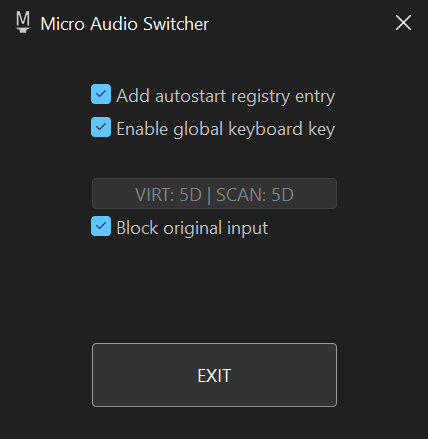

# Micro Audio Switcher

I made this program to solve one nasty Windows usability issue - switching between audio devices. If you frequently switch between headphones/speakers on your PC - you know the pain! In Windows 10 Microsoft made it a little less painful than in older versions, but still even now it takes 4 (!) mouse clicks to change device, which is unacceptable.

At first I tried to find any ready solutions for this, and I wasn't satisfied. They all offer too much GUI bloat and additional useless features, while at the same time making the switching itself, which must be THE feature, harder than it should be, still.

So, I combined solutions found in multiple other programs and ended up with, as it seems, perfect audio playback devices switcher. Some of the main features:

* It has no tray icon to uselessly sit in it most of the time (to open program options after closing it with `X`, launch the `.exe` file again)
* To cycle between audio playback devices you just press `Middle Mouse Button` on the default tray sound icon - , as simple as that
* Optionally you can also enable very powerful _SINGLE_ key global hotkey. Yes, you can even set keys that normally can't be mapped, like `Applications key` or `Right Windows key` or even some OEM keys! And you can even block it's original function, so that it will only serve as audio switching key! _Note: you will have to launch the Micro Audio Switcher with admin rights if you want the hotkey to work in elevated (admin) applications. You don't need admin rights if you only plan to use mouse for switching or don't mind not being able to switch audio with hotkey in elevated programs_
* __Bonus feature:__ you can change sound volume level of active device by hovering mouse over the  and rotating the mouse wheel!
* __Bonus feature:__ you can mute/unmute active device by long-pressing Middle Mouse Button over the !
* Uses miniscule amount of RAM and only uses tiny amount of CPU when you move mouse over the Taskbar, otherwise uses no CPU at all.

Behind the scenes, it uses specific local mouse hook set on the Taskbar's thread and Low Lever Keyboard hook for hotkey feature. Note: by default, hotkey is disabled, so LL Keyboard Hook is set only when you enable it.
